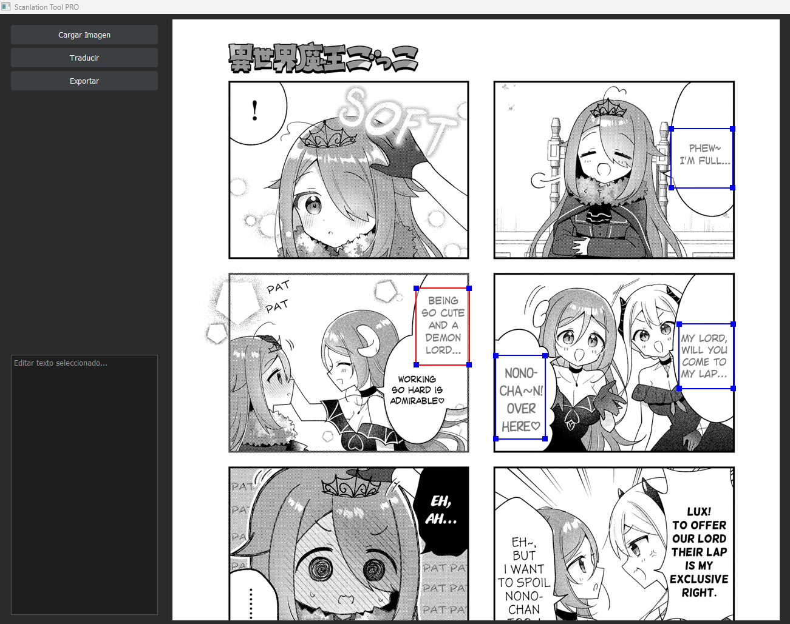
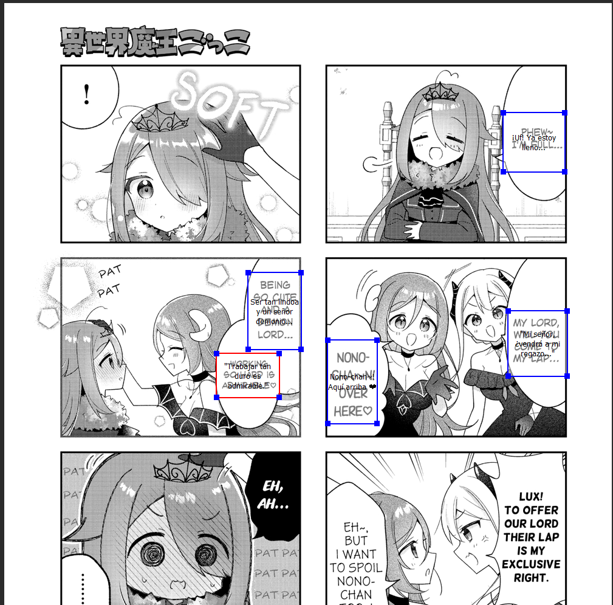
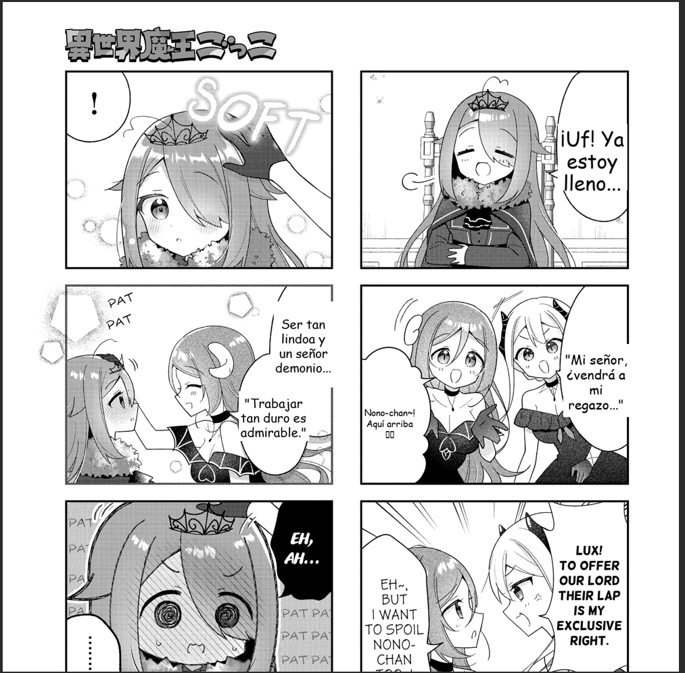

# 🖼️ Scanlation Tool PRO

Herramienta local para scanlation que permite seleccionar áreas de texto en imágenes, traducirlas con IA local y reinsertarlas automáticamente.

## 🚀 Características

- 📂 Cargar imágenes (soporta imágenes largas tipo manhwa)
- ✂️ Selección manual de múltiples áreas de texto
- 🤖 OCR + traducción automática usando IA local (LM Studio)
- 📝 Edición manual del texto traducido
- 🎯 Posicionamiento automático del texto dentro del área seleccionada
- 🧠 Evita retraducir áreas ya procesadas
- 📤 Exportación final como imagen
- 🧩 Interfaz modular (fácil de extender)

---

## 🛠️ Tecnologías

- Python 3
- PyQt5 (UI)
- Pillow (procesamiento de imagen)
- LM Studio (IA local)

---

## 📦 Instalación

### 1. Clonar repositorio

```bash
git clone https://github.com/NeonHartPrime/scanlation-tool.git
cd scanlation-tool
```

### 2. Crear entorno virtual
```bash
python -m venv venv
venv\Scripts\activate
```

### 3. Instalar dependencias
```bash
pip install -r requirements.txt
```

### ▶️ Uso
```bash
python main.py
```
## 🖼️ Vista previa
<p align="center">
  
</p>
<p align="center">
  
</p>
<p align="center">
  
</p>

### ⚙️ Requisitos
* Tener LM Studio corriendo en:
```bash
verifica http://localhost:1234
```
* inicia el sv manualmente con
```bash
lms server start
```
* Modelo Probado:
```bash
gemma-3-4b
cabe aclarar que debe ser la vercion compatible con imagenes
```

### 🧠 Flujo de trabajo
* Cargar imagen
* Seleccionar áreas de texto
* Presionar "Traducir"
* Editar texto si es necesario
* Exportar imagen final

### 📌 Notas
* No traduce áreas ya procesadas
* Optimizado para imágenes largas (webtoon/manhwa)
* Funciona completamente offline (IA local)


